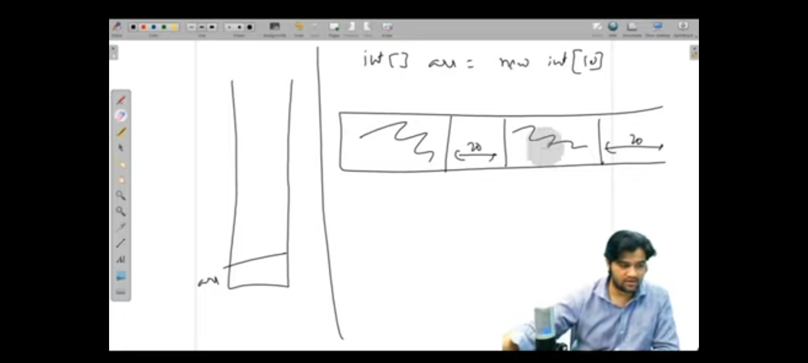
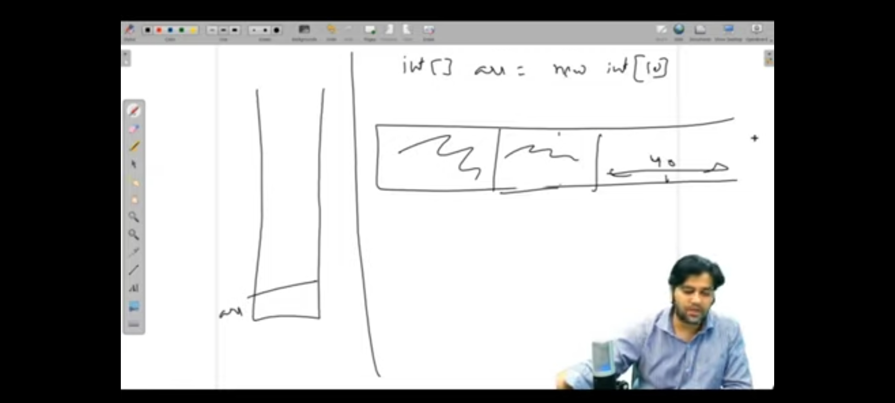
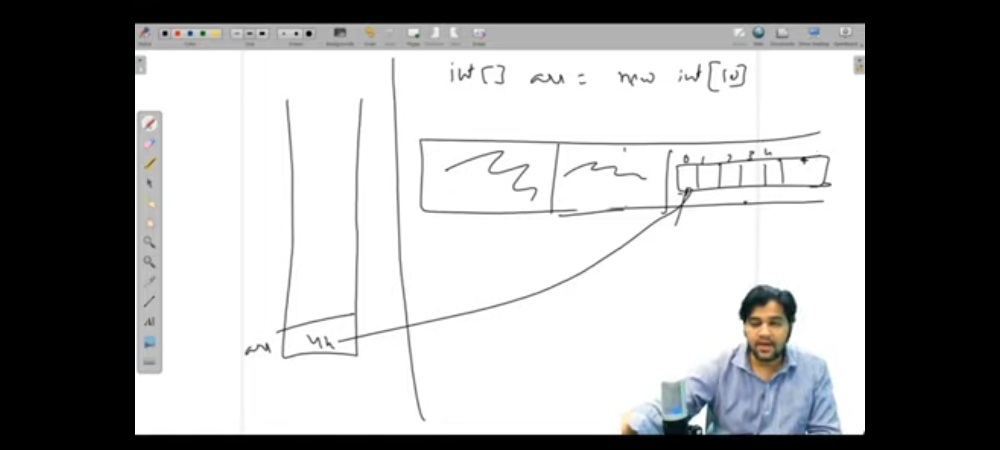
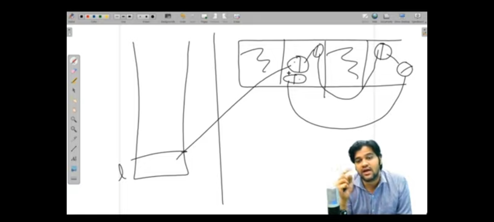
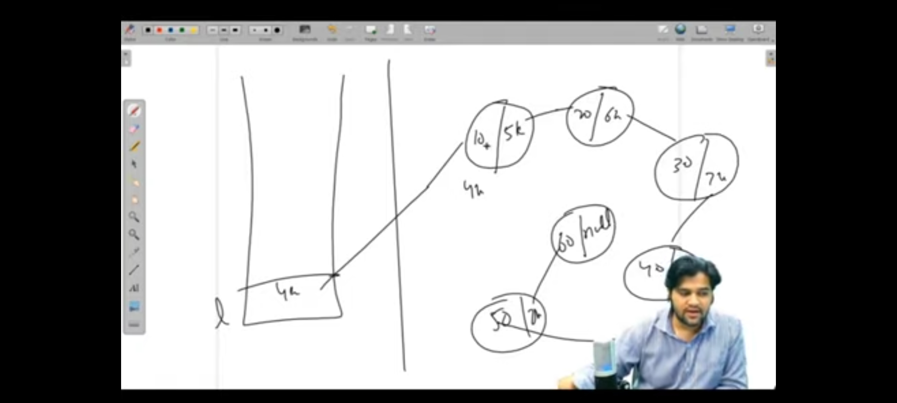
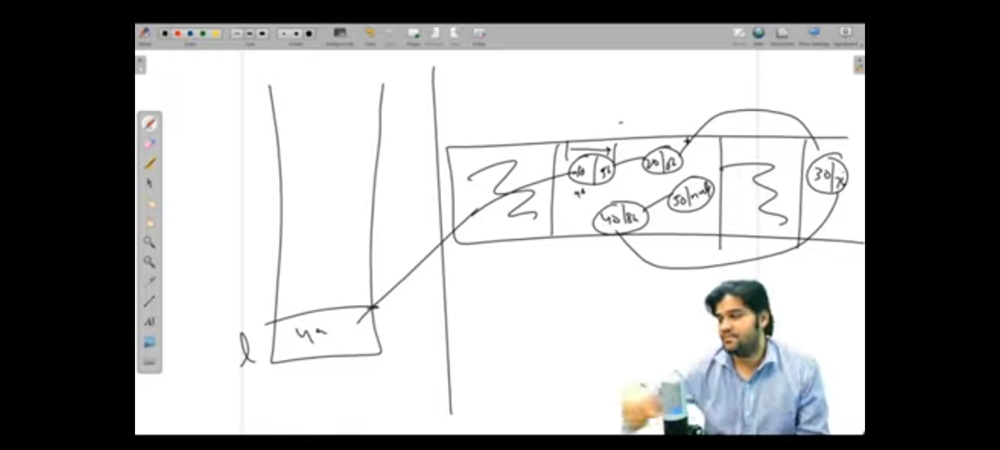
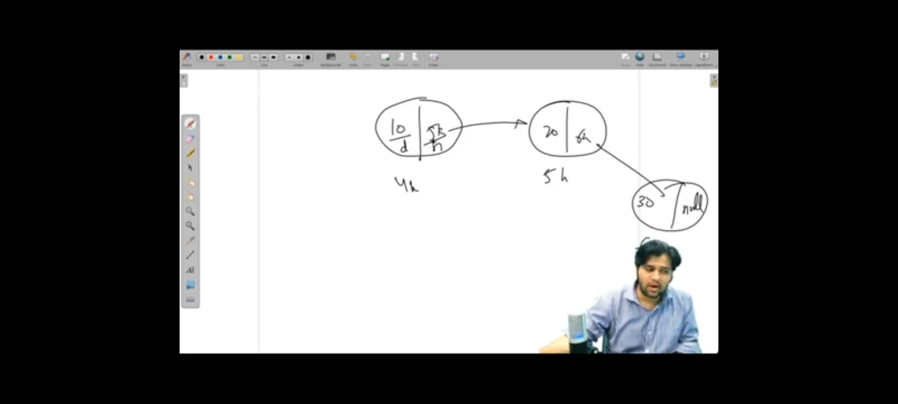
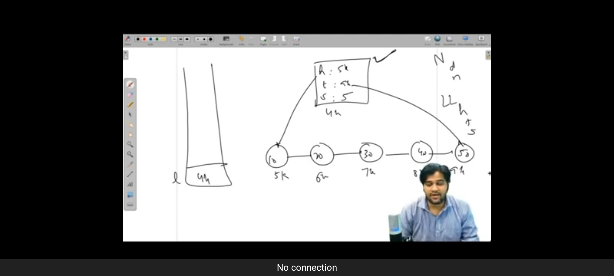
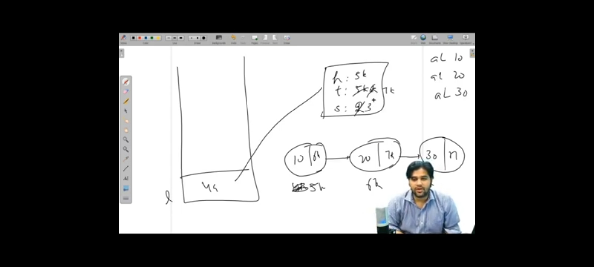

# LINKED LISTS

---

---

---

---

---

---

* Linked List utilized space in case of fragmented memory

* Array use 4-Bytes to store a integer value
* But Linked List use 8-Bytes to store a Integer value
  * 8-Bytes = 4bytes (value) + 4bytes (address)

---

---

---

# QUESTIONS

1. Add Last in Linked List

---

2. 